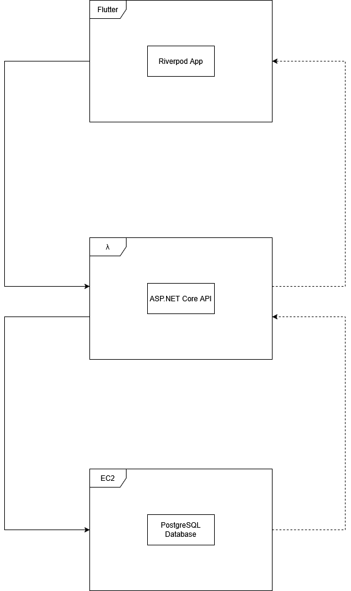

# Swimming App

This file contains the documentation for a swimming application

## Content

- [Things To Do](#things-to-do)
- [Random Scribble Notes](#random-scribble-notes)
- [Business Requirements](#business-requirements)
- [Features](#features)
- [Data and Architecture](#data-and-architecture)
- [Technology Stack](#technology-stack)
- [Pricing Plans](#pricing-plans)

## Things To Do

### Authentication

- [ ] Authentication Service
  - [ ] Twilio Class
    - [ ] Submit application to buy phone number
    - [ ] Buy phone number
  - [ ] JWT Class
    - [ ] refresh token generation function
    - [ ] access token generation function
    - [ ] renew access function
- [ ] Authentication Controller
  - [ ] Login endpoint
  - [ ] Logout endpoint
  - [ ] Refresh endpoint

### Notifications

- [ ] Notification Service
  - [ ] Send notification Function
  - [ ] Implement placeholders of notifications
    - [ ] `x sent you a friend request`
    - [ ] `x just hit a pb in y event`
    - [ ] `x just aquired a badge`
    - [ ] `x has requested to join your squad`
    - [ ] `x has requested to join your club`
    - [ ] ...
- [ ] Firebase Messaging Service

### Users

- [ ] User Controller
  - [ ] GetUsers
    - [ ] Add Query Params
  - [ ] GetUser
  - [ ] PostUser
  - [ ] PatchUser
  - [ ] DeleteUser
- [ ] User Service
- [ ] User Repo
- [ ] User Model
  - [ ] Add Friend Table Relationship

### Swim

- [ ] Swim Controller
  - [ ] GetSwims
    - [ ] Add Query Params
    - [ ] Search by userId
  - [ ] GetSwim
  - [ ] PostSwim
    - [ ] Check achievements on post
  - [ ] PatchSwim
  - [ ] DeleteSwim
- [ ] Swim Service
  - [ ] Calculate statistics when fetching swims
    - [ ] Stroke rate % off PB
    - [ ] Stroke rate % off Goal
    - [ ] Exertion above or below average
    - [ ] Heart rate above or below average 
    - [ ] Event
    - [ ] Time % Off PB
    - [ ] Time % Off Goal

### Squad

- [ ] Squad Controller
  - [ ] GetSquads
  - [ ] GetSquad
  - [ ] PostSquad
  - [ ] PatchSquad
  - [ ] DeleteSquad
- [ ] Squad Service
  - [ ] Transfer Ownership
  - [ ] Add coach
  - [ ] Remove coach

### Club

- [ ] Club Controller
  - [ ] GetClubs
  - [ ] GetClub
  - [ ] PostClub
  - [ ] PatchClub
  - [ ] DeleteClub
- [ ] Club Service
  - [ ] Transfer Ownership
  - [ ] Add Admin
  - [ ] Remove Admin

### Timetable

- [ ] Timetable Controller
  - [ ] GetTimeTables
  - [ ] GetTimetable
  - [ ] PostTimetable
  - [ ] DeleteTimetable
- [ ] Timetable Service
  - [ ] Add Session
  - [ ] Remove Session

### Session

- [ ] Session Controller
  - [ ] GetSessions
    - [ ] ByCoach
    - [ ] ByTimetable
    - [ ] BySquad
  - [ ] GetSession
  - [ ] PostSession
  - [ ] PatchSession
  - [ ] DeleteSession
- [ ] Session Service
  - [ ] Attach Session to Timetable
  - [ ] Detach Session from Timetable

### SessionItem


## Random Scribble Notes

### Michal Notes (3/3/2025)

I talked to Michal tonight and he had some ideas.

- Integrate polar flow with swimming app.
- Track user data for a session and make calculations on stress undergone by swimmers and performance.
- 1 Device with the coach mode would serve as a interface to get the data and stream it to the api.

>[!NOTE]
[The polar flow dev kit](https://www.polar.com/en/business/developers)

### For the coaches (3/03/2025)

I was just thinking about a main selling point to get the entire swimming squad on this.

A selling point could be to allow coaches to view the macro effects of the current load in training.

- Coaches could be able to view how the squad is training relative to their goal times / current PB times __both individually and as a squad.__
- Additionally an ability to see when in the week athletes are peaking by showing how close they are to their goal times with a graph.
  - On the Y-Axis you might have percentage off of time.
  - X-Axis you have the day or month or whatever


## Business Requirements

### Data

```cs
public class Club {
  public int Id;
  public int Name;
  public Link? ProfilePicture;

  // 1 Club can have 1 or more squads
  public ICollection<Squad>? squads;
}

public class Squad {
  public int Id;
  public int Name;

  // 1 Squad belongs to 1 and Only 1 Club
  required public int clubId;
  required public Club club;


  public ICollection<SwimmerProfile>? swimmers; 
  public ICollection<CoachProfile>? coaches;
}

public abstract class User {
  public int Id;
  public string PhoneNum;
  public string Name;
  public int? Age;
  public string? Email;
  public Link? ProfilePicture;
}

public SwimmerProfile : User {
  public string MainStroke;
  public int MainDistance;
  public string GoalTime;
  public List<Swim>? Swims;
}

public class Swim {
  public int Id;
  public string Stroke;
  public int Distance;
  public string Time;
  public int? StrokeRate;
  public int? Pace;
  public int? PerceivedExertion;
  public int? HeartRate;
  public bool? Dive;
  public List<Swims>? Splits;
}


```

## Features

### Accounts Types / Signing Up

Upon downloading the app users will be able to select from a variety of different parameters when constructing an account / profile.

Upon signing up they will be prompted for the following (not limited to these. These are just compulsory fields).

- Phone number
  - Phone registration rather than email because verification by phone is __quicker__
- Name
  - Profile name
- Type
  - Viewer
  - Coach
  - Swimmer
- Main Stroke
- Main Distance
- Goal Time
  - After entering the goal time the next page will show what you need to be hitting at each interval.


### Profiles

Users will be able to create their own profiles. The profiles will have settable:

- Profile pictures
  - Retrieved from __S3__ or __lambda__
- Usernames / display name
  - Set on account creation and stored in __PostgreSQL__
- Description
  - Set on account creation and stored in __PostgreSQL__
- Groups
  - Stored in __PostgreSQL__
  - These can be squads, clubs, etc. (maybe this needs to be modelled in a specific way with squads and clubs as their own tables)
- Coach
  - Stored in __PostgreSQL__
- What data users wish to show
  - Data you wish to be visible is shown in a form of __toggles__ on an edit profile
  - Data is calculated on __frontend__ by retrieving user's data

Users will be also be able to search for and view other swimmer profiles. As a user you will be able to see

- Username
- Latest time
- Last set
- Weekly performance
  - How far percentage wise theyre off their goal times / splits
- When the athlete performs the best
  - Which day of the week
- A radar chart of the swimmers different strokes
  - Gives people an idea of their main stroke + looks cool


### Swims

### View Swims

### Compare Swimmers

- Users should be able to select 2 swimmers and compare statistics based on the 2 swimmers and view data like who has a better frontend / backend for the same stroke

## Data and Architecture

### Data

### Architecture 



- Flutter sends requests to the __lambda function__
- These are then passed to the __EC2__ PostgreSQL

## Technology Stack

## Pricing Plans

There are two main types of account; paid and unpaid

### Unpaid Account

#### Applies To:

- Parent

#### Abilities

Parent accounts will be able to:

- Essentially do everything that a swimmer can do but you cant add swims and participate 

### Paid Accounts

#### Applies To:

- Swimmer
- Coach

#### Abilities:

Swimmers accounts will be able to:

- Log Swim information
- View Sets
  


